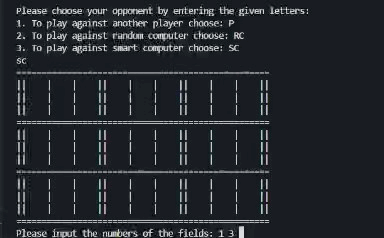

The game of Quantum Tic Tac Toe 
--------------------------------------------------------------------------

Quantum Tic-Tac-Toe is a variant of Tic-Tac-Toe that incorporates quantum mechanics principles like superposition and entanglement. Instead of placing a definite mark (X or O), players place quantum moves, which exist in multiple squares simultaneously. These moves remain in superposition until a loop (entanglement) forces a collapse, resolving into classical marks. The game adds strategy and unpredictability, requiring players to think in terms of probability and quantum states.

The game can be played against another player, a random AI, or a smart AI that selects the best strategy based on the player's moves. 

This game was created during my first semester at Warsaw University of Technology. 
Below is the description written for the PIPR course in the winter semester of 2022.
---------------------------------------------------------------------------
KWANTOWE KÓŁKO I KRZYŻYK

Cel i opis projektu:

Celem projektu jest stworzenie gry w kwantowe kółko i krzyżyk pozwalającej na rozgrywkę między graczem a graczem, graczem a komputerem losowy oraz graczem a komputerem myślącym.
Plansza do gry domyślnie jest kwadratem o wielkości 3x3, w której każde pole składa się również z planszy 3x3. W dużej planszy (wyznaczonej przez podwójne linie) umieszczane będę ostateczne znaczki (znaczki otrzymane po rozpadzie) w małych zaś pojawiać się będę małe znaczki (ang. ’spooky marks’ – tej nazwy będę używać w dalszej części dokumentacji).

Rozgrywka w kwantowe kółko i krzyżyk przebiega następująco:

1. Gracz ‘X’ (mający swój ruch zawsze w rundzie o numerze nieparzystym) wybiera spośród dziewięciu dużych pól dwa, w których stawia swoje ’spooky marks’ (każdy z nich jest połączeniem nazwy gracza (‘X’ bądź ‘O’) oraz numeru rundy, w której ten ‘spooky mark’ został postawiony. Przykład: ‘X1’, ‘O4’). Istotnym jest, że wybrane pola muszą być różne. ’Spooky mark’ umieszczany jest w podanym przez gracza polu na tej pozycji małego pola, która jest równa numerowi rundy.

2. Następnie ruch swój ma gracz ‘O’ (gracz numer 2, lub jeden z komputerów). Gracz ‘O’ zawsze ma swój ruch w rundzie o numerze parzystym. Również i on umieszcza dwa ’spooky marks’ w dwóch różnych polach.

3. Gracze zamieniają się ruchami do momentu nastąpienia rozpadu. Rozpad to cykliczne powiązanie ’spooky
marks’. By zrozumieć jak tworzą się takie powiązania i w jaki sposób następuje rozpad musimy przyjrzeć się podstawowej zasadzie fizyki kwantowej. Zakłada ona, że obiekt do momentu, w którym nie zostanie zauważony może znajdować się w dwóch miejscach jednocześnie. Swoje prawdziwe miejsce zajmuje dopiero po rozpadzie, rozpad natomiast ma miejsce gdy nastąpi cykliczne powiązanie pól.

Przykład:
Gdy w polu 1 znajdują się ‘spooky marks’: ‘X1’, ‘O2’, w polu 4: ‘O2’, ‘X3’ a w polu 8: ‘X1’, ‘X3’ to  nastąpiło cykliczne powiązanie tych pól – ‘X1’ łączy pola: 8 i 1, ‘O2’ pola 1 i 4, a ‘X3’ pola 4 i 8. Te ‘spooky marks’ wezmą udział w rozpadzie.

Niezależnie od ilości ‘spooky marks’ i pól biorących udział w rozpadzie istnieją zawsze tylko dwie opcje rozpadu. W przypadku gdy jeden z graczy doprowadził do rozpadu (czyli to jego ruch spowodował, że powiązanie stało się cykliczne) drugi ma prawo wyboru opcji rozpadu. Decyduje on, który z dwóch wybranych ‘spooky marks’ powinien ostatecznie znaleźć się w danym polu.
Podobne cykle mogą składać się z bardzo wielu powiązanych ze sobą ‘spooky marks’. Ponadto rozpad ‘spooky marks’ należących bezpośrednio do cyklicznego powiązania wpływa także na ‘spooky marks’ nie biorące w nim udziału. Kiedy jedno z pól, w których znajdował się nie biorący udziału w rozpadzie ‘spooky mark’ weźmie udział w rozpadzie, dany ‘spooky mark’ zostaje zmuszony do przyjęcia swojej prawdziwej formy w swoim drugim polu.

4. Pojawiające się w wyniku rozpadu prawdziwe znaczki biorą udział w klasycznej rozgrywce kółka i krzyżyk na dużej planszy. Identycznie jak w klasycznej grze zwycięża tu ten kto ułoży trzy ze swoich znaczków w jednym rzędzie, kolumnie lub na przekątnej.

5. Proces zwyciężania jest jednak bardziej skomplikowany. Ponieważ w wyniku rozpadu na dużej ‘prawdziwej’ planszy znaczki pojawiają się równocześnie (przeciwnie do klasycznej rozgrywki kółka i krzyżyk, gdzie ‘X’ i ‘O’ wstawiane są na zmianę), może dojść do sytuacji, w której pojawi się dwóch zwycięzców. Również i tu mogą wystąpić dwa scenariusze:
    1.	Zwycięzcy są różnych znaków (‘X’ i ‘O’) – w tej sytuacji zwycięzcą otrzymującym 1 punkt staje się gracz, który potrzebował mniejszej ilość rund by odnieść zwycięstwo. Drugi gracz natomiast otrzymuje 0,5 punktu, ponieważ pomimo przegranej i jemu udało się ułożyć wygrywającą sekwencję.
    2.	Zwycięzcą jest jeden gracz (‘X’ lub ‘O’), któremu udało się ułożyć dwie wygrywające sekwencję. Wówczas, jeżeli najwyższe numery rund w obu tych sekwencjach są sobie równe, otrzymuje on 2 punkty, a jeżeli najwyższe numery rund różnią się otrzymuje on 1,5 punktu. W obu tych przypadkach przeciwnik otrzymuje 0 punktów.
    Przyznawanie połówek punktów jest istotne w przypadku, gdy chcielibyśmy rozszerzyć grę o możliwość prowadzenia rankingu graczy lub gdy chcielibyśmy wyznaczać ostatecznego zwycięzcę na podstawie wyników z kilku rund.

Podział programu na klasy i opis klas:

1.	Klasa Player:
- Umożliwia ona graczowi wybór pól, w których chciałby ustawić swoje ‘spooky marks’,
- Sprawdza poprawność wybranych przez gracza pól,
- Pozwala graczowi na wybór opcji rozpadu – dając mu możliwość decyzji, który ze wskazanych, biorących udział w rozpadzie ‘spooky marks’ powinien ostatecznie znaleźć się we wskazanym polu.
2.	Klasa RandomComputer:
- Daje losowemu komputerowi możliwość wylosowania dwóch spośród dostępnych pól, w których umieszczone zostaną ‘spooky marks’,
- Umożliwia mu wylosowanie jednej z dwóch opcji rozpadu.
3.	Klasa SmartComputer:
- Daje myślącemu komputerowi możliwość wylosowania dwóch spośród dostępnych pól, w których umieszczone zostaną ‘spooky marks’,
- Posiada metody pozwalające na sprawdzenie, która z dwóch opcji rozpadu będzie korzystniejsza dla komputera i na tej podstawie decyduje, który z podanych ‘spooky marks’ powinien zostać umieszczony w danym polu podczas rozpadu.
4.	Klasa Board;
- Umożliwia przeprowadzenie rozgrywki w kwantowe kółko i krzyżyk,
- Posiada metody pozwalające na umieszczenie ‘spooky marks’ w danym miejscu planszy, sprawdzające wystąpienie możliwości rozpadu i wykonujące go, gdy taka sytuacja zaistnieje,
- Posiada także metody potrafiące wyłonić wszystkie wygrywające sekwencje na planszy i na ich podstawie wybrać zwycięzcę rozgrywki.

Instrukcja użytkownika:

1.	Aby rozpocząć grę należy otworzyć terminal a następnie wpisać w nim komendę python3 main.py.
2.	Następnie gracz powinien podać swoje imię (nick).
3.	Kolejnym krokiem będzie wybór przeciwnika. Gracz może zmierzyć się z innym graczem wybierając literę P, z komputerem losowym wybierając litery RC lub komputerem myślącym wybierając SC. Jeżeli gracz wybrał opcję gry przeciwko innemu graczowi, wtedy i on powinien wpisać swoje imię (nick).
4.	Gra rozpoczyna się, a gracz proszony jest o podanie dwóch cyfr (cyfry te mogą być złączone lub oddzielone dowolną ilością spacji).
5.	‘Spooky marks’ gracza wyświetlane są na planszy w wybranych przez niego polach. Plansza ta, aktualizowana po każdym ruchu, będzie pojawiała się po posunięciu zarówno gracza jak i przeciwnika i to na niej będzie mógł on kontrolować stan rozgrywki.
6.	Następnie identyczny ruch wykonuje drugi gracz (lub jest on automatycznie wykonywany przez komputer).
7.	Gracze wymieniają się ruchami do momentu nastąpienia rozpadu. Wtedy to ten gracz, który nie przyczynił się do stworzenia cyklicznego powiązania dostaje prawo wyboru rozpadu. Jest on proszony o wpisanie jednego z podanych w poleceniu ‘spooky marks’.
8.	Następnie wyświetlany jest wynik rozpadu. Duże ‘prawdziwe’ znaczki gracza ‘X’ wyświetlane są w środku małego pola kolorem czerwonym, natomiast gracza ‘O’ kolorem zielonym. Każdy z tych znaczków ma obok siebie również numer rundy, który ma znaczenie dla rozstrzygnięcia rozgrywki.
9.	Rozgrywka toczy się dalej, aż do momentu zwycięstwa jednego z graczy lub końca gry, gdy gracze rozegrają wszystkie rundy (domyślnie 9). W przypadku braku zwycięscy rozgrywka kończy się nierozstrzygnięta. Komunikat o stanie końcowym gry jest wyświetlany na ekranie.

Refleksja:

Projekt bardzo mnie zaciekawił. Uważam, że udało mi się zrealizować wszystkie moje początkowe założenia. Udało mi się stworzyć funkcjonujący algorytm rozpoznawania i przeprowadzania rozpadu, jak i wyłaniania zwycięzcy rozgrywki. Zaprogramowałam także komputer myślący, który jest w stanie zadecydować czy wybrana opcja rozpadu zagwarantuje mu zwycięstwo, a także potrafi uniemożliwić wygraną przeciwnikowi. Cieszę się także, że oprócz możliwości gry przeciwko komputerowi losowemu i myślącemu gracz jest także w stanie zmierzyć się z innym graczem. Mam także jeszcze kilka pomysłów jak mogłabym ulepszyć moją grę w kwantowe kółko i krzyżyk. Chciałabym utworzyć do niej interfejs graficzny oraz dać graczowi możliwość wyjścia z gry lub jej zrestartowania w dowolnym momencie rozgrywki. Myślałam także nad możliwość rozegrania turnieju - kilku rozgrywek, w której zwycięzca wyłaniany byłby na podstawie osiągnięć z kilku starć.
